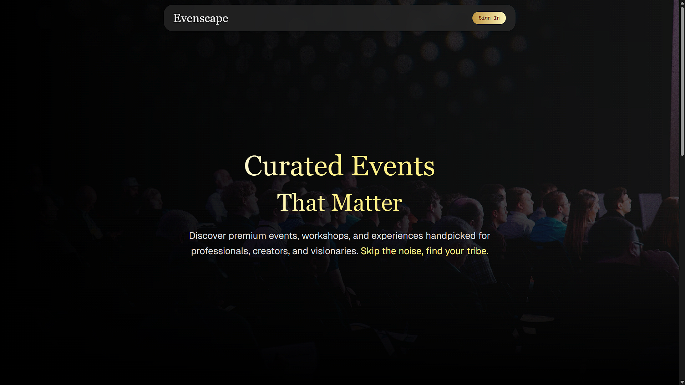
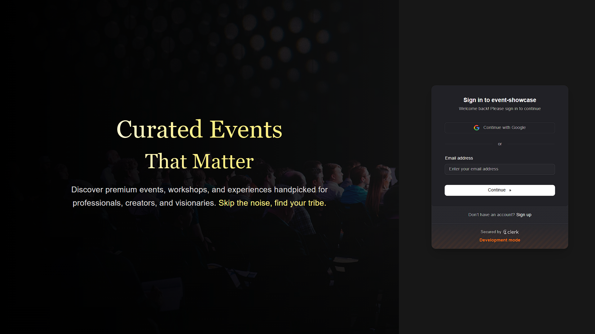
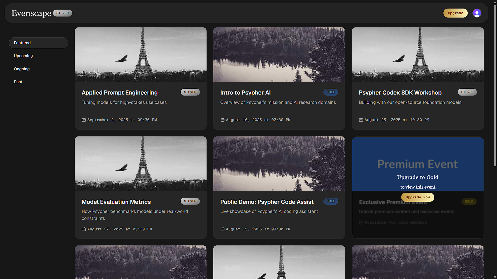
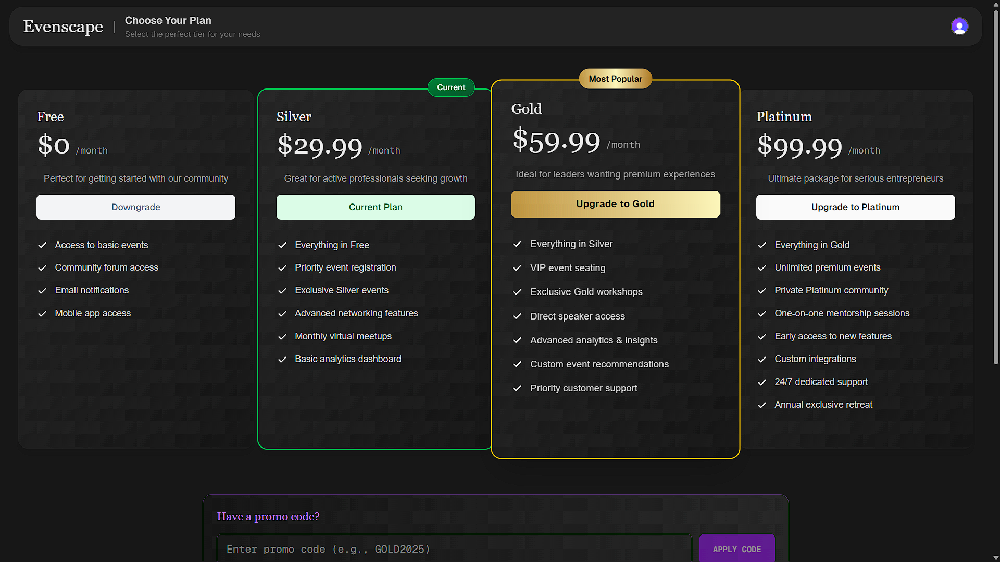

# Evenscape

> Tier-based event showcase platform with secure, scalable architecture.

| Home Page                       | Sign In                           |
| ------------------------------- | --------------------------------- |
|  |  |

| Events Dashboard                  | Tier Upgrade                       |
| --------------------------------- | ---------------------------------- |
|  |  |

## Features

- Server-side tier-based access control
- Clerk authentication + Supabase backend
- Responsive UI with Tailwind + Framer Motion
- Full-stack Next.js 14 App Router architecture
- Role inheritance: Platinum > Gold > Silver > Free

## Tech Stack

| Category           | Technology              |
| ------------------ | ----------------------- |
| **Framework**      | Next.js 14 (App Router) |
| **Language**       | TypeScript              |
| **Authentication** | Clerk.dev               |
| **Database**       | Supabase (PostgreSQL)   |
| **Styling**        | Tailwind CSS            |
| **Animations**     | Framer Motion           |
| **Icons**          | Lucide React            |
| **Deployment**     | Vercel                  |

## Architecture

```md
app/
├── (auth)/ # Authentication routes (sign-in/sign-up)
│ ├── sign-in/ # Clerk sign-in page
│ └── sign-up/ # Clerk sign-up page
├── api/
│ ├── events/ # Events API endpoint
│ └── tier/ # Tier update API endpoint
├── events/ # Protected events listing page
├── upgrade/ # Tier upgrade interface
└── components/ # Reusable UI components
├── ui/ # Base UI components
├── EventCard.tsx # Event display component
├── TierBadge.tsx # Tier indicator component
└── Navbar.tsx # Navigation component
lib/
├── supabase.ts # Supabase client configuration
├── utils.ts # Utility functions
└── types.ts # TypeScript type definitions
```

```sql
CREATE TYPE tier_type AS ENUM ('free', 'silver', 'gold', 'platinum');
CREATE TABLE events (
  id UUID PRIMARY KEY DEFAULT gen_random_uuid(),
  title TEXT,
  description TEXT,
  event_date TIMESTAMPTZ,
  image_url TEXT,
  tier tier_type,
  created_at TIMESTAMPTZ DEFAULT NOW()
);
```

## Auth + API Flow

```typescript
// API Route Example (/api/events/route.ts)
export async function GET() {
  const { userId } = auth();
  if (!userId)
    return NextResponse.json({ error: "Unauthorized" }, { status: 401 });

  const user = await clerkClient.users.getUser(userId);
  const userTier = (user.publicMetadata?.tier as string) || "free";

  // Tier hierarchy: each tier can access its level and below
  const accessibleTiers = getTierHierarchy(userTier);

  const { data: events } = await supabase
    .from("events")
    .select("*")
    .in("tier", accessibleTiers)
    .order("event_date", { ascending: true });

  return NextResponse.json({ events, userTier });
}
```

## Quick Start

### Prerequisites

- Node.js 18+ and npm
- Clerk.dev account
- Supabase project

### Installation

1. **Clone the repository**

   ```bash
   git clone https://github.com/gautamankoji/evenscape-event-showcase.git
   cd evenscape-event-showcase
   ```

2. **Install dependencies**

   ```bash
   npm install
   ```

3. **Environment setup**

   ```bash
   cp .env.example .env.local
   ```

   Fill in your environment variables:

   ```env
   # Clerk Authentication
   NEXT_PUBLIC_CLERK_PUBLISHABLE_KEY=pk_test_...
   CLERK_SECRET_KEY=sk_test_...
   NEXT_PUBLIC_CLERK_SIGN_IN_URL=/sign-in
   NEXT_PUBLIC_CLERK_SIGN_UP_URL=/sign-up

   # Supabase Database
   NEXT_PUBLIC_SUPABASE_URL=https://your-project.supabase.co
   NEXT_PUBLIC_SUPABASE_ANON_KEY=eyJhbGciOiJIUzI1NiIsInR5cCI6IkpXVCJ9...
   ```

4. **Database setup**

   - Create the events table using the schema above
   - Insert sample data for testing

5. **Start development server**

   ```bash
   npm run dev
   ```

6. **Visit** `http://localhost:3000`

## 👥 Demo User Accounts

| Tier         | Email                      | Password                  | Access Level                 |
| ------------ | -------------------------- | ------------------------- | ---------------------------- |
| **Free**     | <test.free@psypher.ai>     | test.free@psypher.ai      | Free events only             |
| **Silver**   | <test.silver@psypher.ai>   | test.silver@psypher.ai    | Free + Silver events         |
| **Gold**     | <test.gold@psypher.ai>     | test.gold@psypher.ai!     | Free + Silver + Gold events  |
| **Platinum** | <test.platinum@psypher.ai> | test.platinum@psypher.ai! | All events (Free → Platinum) |

> **Note**: Create these test users in your Clerk dashboard and set their tier in the `publicMetadata` field.

## License

MIT
